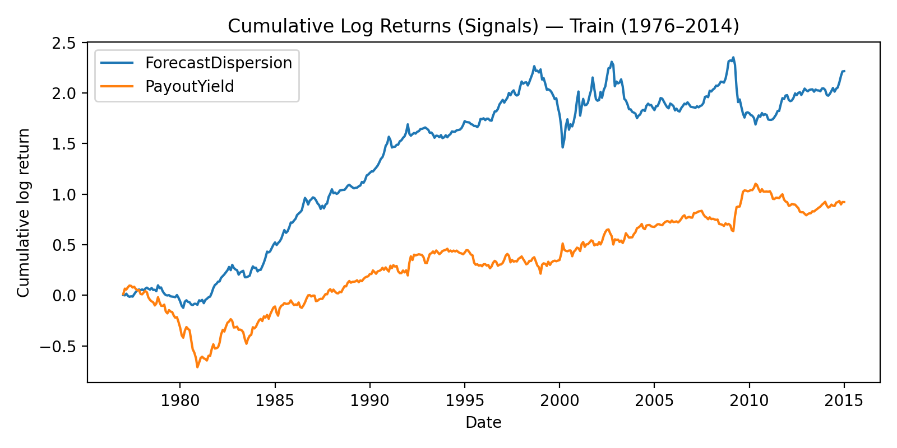
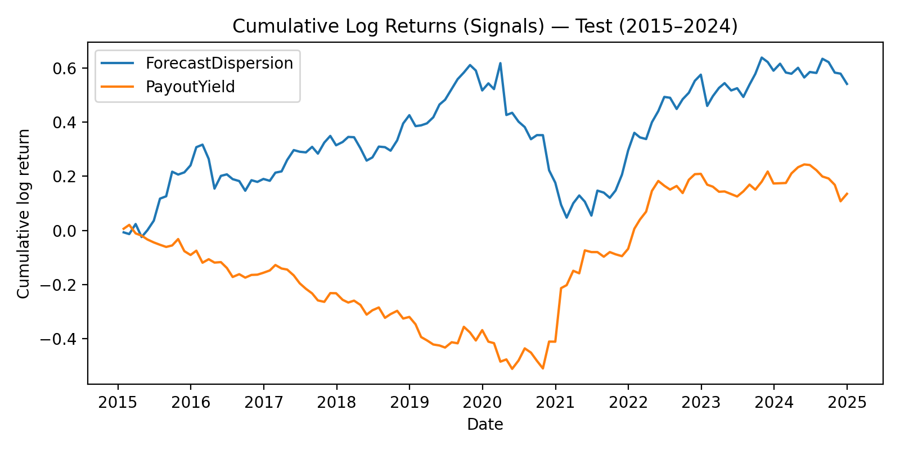
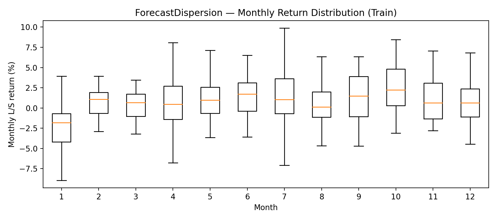
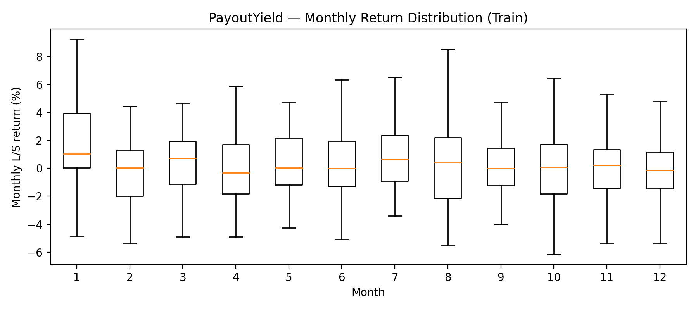
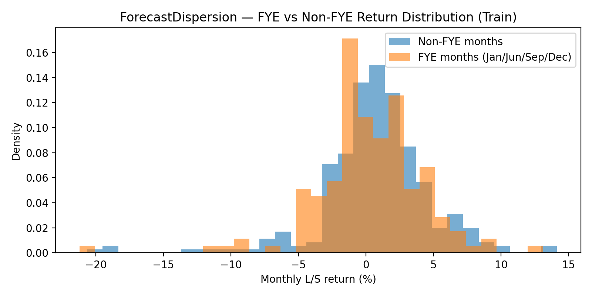
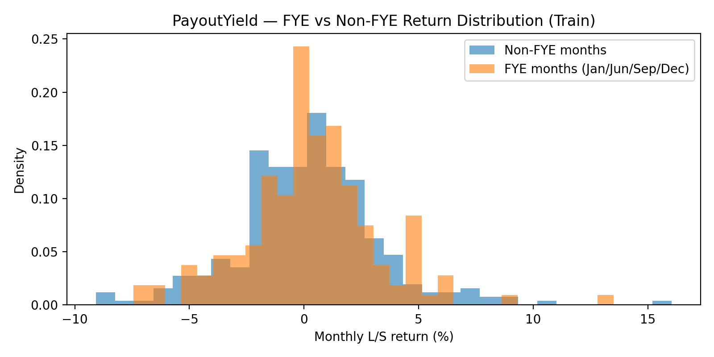
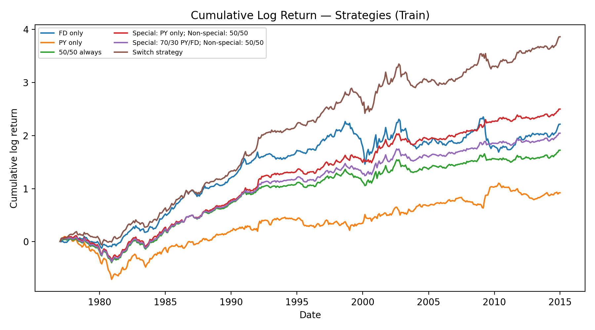
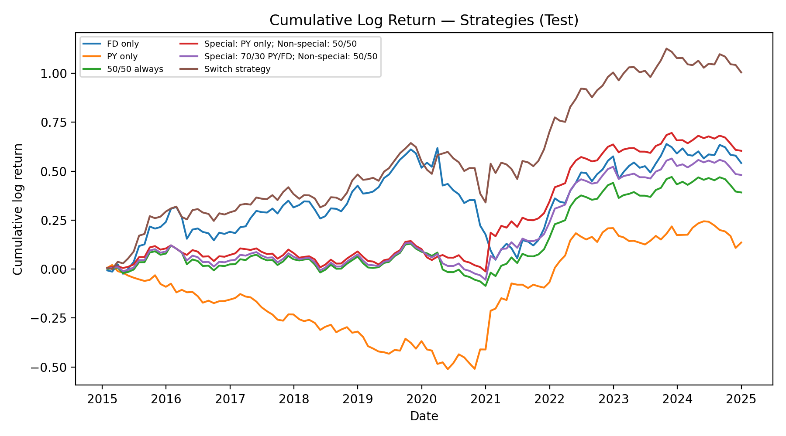

# Earnings Volatility Timing Around Macro Events

Calendar-based **earnings-season intensity** can act like a recurring “macro-information regime.” This project tests whether two established cross-sectional equity signals:

- **Forecast Dispersion (FD)**: analyst EPS forecast dispersion (a disagreement/uncertainty proxy)
- **Payout Yield (PY)**: dividends + net repurchases scaled by market equity (a shareholder distribution signal)

have **systematically different long–short payoffs** during earnings-heavy calendar windows, and whether a simple **month-conditioned switching rule** can improve risk-adjusted performance.

---

## Repository contents

```
.
├── macro_earnings_vol_demo.ipynb      # End-to-end analysis + backtest
├── Earnings_volatility.pdf            # Write-up / paper
├── PredictorLSretWide.csv             # Monthly long–short predictor returns (wide)
└── figures/
    ├── cum_log_signals_train.png
    ├── cum_log_signals_test.png
    ├── cum_log_strategies_train.png
    ├── cum_log_strategies_test.png
    ├── boxplot_fd_train.png
    ├── boxplot_py_train.png
    ├── fye_vs_nonfye_fd_train.png
    └── fye_vs_nonfye_py_train.png
```

---

## Quickstart

### 1) Environment

```bash
python -m venv .venv
source .venv/bin/activate  # (Windows: .venv\Scripts\activate)
pip install -U pip
pip install pandas numpy matplotlib scipy jupyter
```

### 2) Run the notebook

```bash
jupyter notebook macro_earnings_vol_demo.ipynb
```

---

## Data

- Frequency: **monthly**
- Units: **percent return per month** for each L/S factor series (e.g., `1.2` means +1.2% in that month)
- Analysis window: **1976-12 through 2024-12**
- Train (in-sample): **1976-12 to 2014-12**
- Test (out-of-sample): **2015-01 to 2024-12**

Signals used from `PredictorLSretWide.csv`:
- `ForecastDispersion`
- `PayoutYield`

---

## Event definitions (calendar regimes)

We test month sets that proxy for reporting intensity:

- **FYE months:** `{Jan, Jun, Sep, Dec}`
- **Quarterly reporting peaks:** `{Jan, Apr, Jul, Oct}`

Based on training-sample evidence, the final months used for switching are:

- **Special months:** `{January, April}`

---

## Strategy design

Let:

- \( r^{FD}_t \) = monthly L/S return of Forecast Dispersion  
- \( r^{PY}_t \) = monthly L/S return of Payout Yield  
- \( m_t \in \{1,\dots,12\} \) = calendar month  
- \( S = \{1,4\} \) = special months (Jan, Apr)

### Hard switch rule (main)

\[
r^{SW}_t =
\begin{cases}
r^{PY}_t & \text{if } m_t \in S \\
r^{FD}_t & \text{otherwise}
\end{cases}
\]

Benchmarks:
- FD only
- PY only
- Static 50/50 blend
- Smoothed variants that tilt toward PY in special months

---

## Figures

### Signals: cumulative log returns

**Train (1976–2014)**  


**Test (2015–2024)**  


### Seasonality diagnostics (train)

Monthly boxplots by calendar month:





FYE vs non-FYE return distributions (train):





### Strategy equity curves (cumulative log)

**Train (1976–2014)**  


**Test (2015–2024)**  


---

## Performance tables

Metrics:
- **CAGR**: geometric annualized return from monthly compounding
- **AnnVol**: annualized volatility (std × √12)
- **Sharpe**: annualized (mean / std) × √12
- **MaxDD**: max drawdown on compounded equity curve

### Train (1976-12 to 2014-12)

| Strategy | CAGR(%) | AnnVol(%) | Sharpe | MaxDD(%) |
|:--|:--:|:--:|:--:|:--:|
| FD only | 5.989 | 14.121 | 0.486 | -55.211 |
| PY only | 2.450 | 10.595 | 0.281 | -55.380 |
| 50/50 always | 4.632 | 8.717 | 0.564 | -36.320 |
| Special: PY only; Non-special: 50/50 | 6.784 | 9.230 | 0.759 | -37.153 |
| Special: 70/30 PY/FD; Non-special: 50/50 | 5.517 | 8.602 | 0.669 | -36.631 |
| Switch strategy | 10.673 | 12.949 | 0.852 | -37.615 |

### Test (2015-01 to 2024-12)

| Strategy | CAGR(%) | AnnVol(%) | Sharpe | MaxDD(%) |
|:--|:--:|:--:|:--:|:--:|
| FD only | 5.563 | 15.363 | 0.431 | -43.473 |
| PY only | 1.364 | 12.191 | 0.169 | -41.244 |
| 50/50 always | 3.990 | 9.202 | 0.471 | -19.353 |
| Special: PY only; Non-special: 50/50 | 6.226 | 10.603 | 0.621 | -14.370 |
| Special: 70/30 PY/FD; Non-special: 50/50 | 4.922 | 9.308 | 0.562 | -17.294 |
| Switch strategy | 10.565 | 14.560 | 0.763 | -26.174 |

---

## Reproducibility notes

- All strategies are **monthly** and use only the factor return series (not security-level replication).
- Decisions are made using the **calendar month** and applied at monthly frequency.
- A live implementation would require point-in-time reconstruction of FD and PY (with explicit lags), plus trading costs, shorting constraints, and capacity checks.

---

## Limitations (important)

This project is factor-series based:
- It uses **pre-constructed L/S factor returns**, not a fully tradable security-level book.
- It does not model transaction costs, borrow fees, or implementation frictions.

Interpret results as evidence about **regime dependence**, not an investable product “as-is.”
